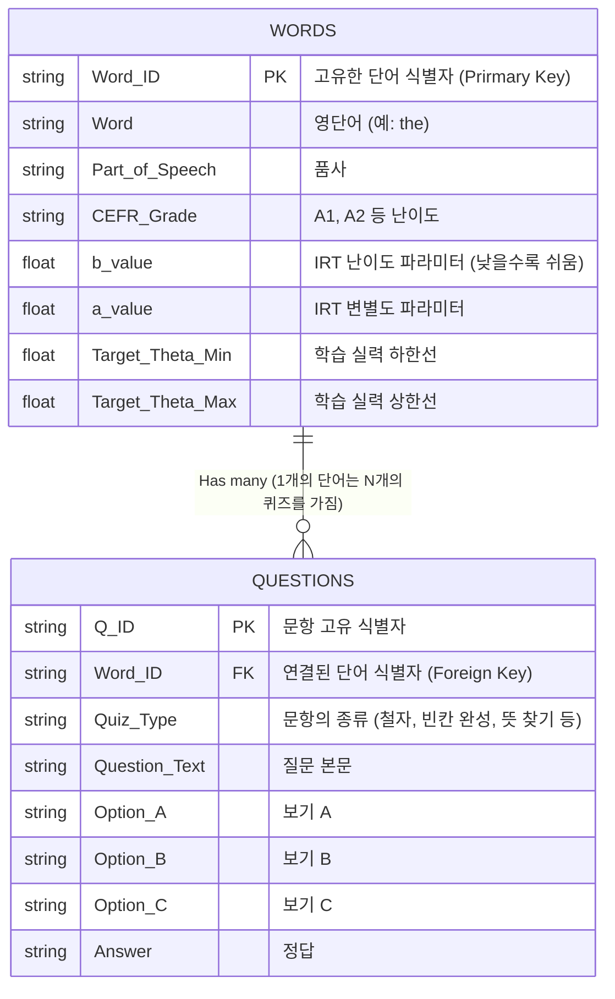

# 어휘 학습 데이터베이스(DB) 종합 분석

현재 `G:\내 드라이브\gsheet-appscript` 경로(저장소)에 위치한 다양한 어휘 DB 파일들의 성격과 내부 데이터 구조를 비교 분석한 문서입니다. 이를 바탕으로 향후 앱 개발 또는 백엔드 서비스(Google Apps Script 등)에 어떤 데이터셋을 적용할지 결정할 수 있습니다.

---

## 1. 최우선 추천 DB: `Vocabulary_Learning_Content.csv`

가장 완성도가 높고 고도화된 메인 데이터베이스입니다. 약 9,000개의 단어가 포함되어 있으며, **문항반응이론(IRT) 기반 적응형 테스트(Adaptive Test)와 사지선다 객관식 자동 출제**를 위한 심화 메타데이터가 완벽하게 갖추어져 있습니다.

### 📊 데이터베이스 구조

| 컬럼명 (Column) | 데이터 성격 | 설명 |
| :--- | :--- | :--- |
| **Word** | 기본 언어 데이터 | 영단어 |
| **FrequencyRank** | 빈도/난이도 | 단어 빈도수 기반 랭킹 |
| **b_value** | IRT 파라미터 | 문항 난이도 파라미터 (낮을수록 쉬움) |
| **a_value** | IRT 파라미터 | 문항 변별도 파라미터 |
| **Difficulty_Band** | 빈도/난이도 | 난이도 등급 / 밴드 |
| **Target_Theta_Min** | 학습자 매핑 | 해당 단어를 학습하기 실력(Theta) 최소치 |
| **Target_Theta_Max** | 학습자 매핑 | 해당 단어를 학습하기 실력(Theta) 최대치 |
| **Korean_Meaning** | 기본 언어 데이터 | 한국어 뜻 |
| **English_Definition**| 기본 언어 데이터 | 영영 사전식 정의 |
| **Part_of_Speech** | 기본 언어 데이터 | 품사 (예: article, verb 등) |
| **Example_Sentence** | 맥락 데이터 | 해당 단어가 포함된 완전한 영어 예문 |
| **Cloze_Sentence** | 평가용 데이터 | 테스트 출제용 빈칸(____) 예문 |
| **Distractor_A, B, C**| 평가용 데이터 | 객관식 사지선다 출제를 위한 매력적인 오답 보기 3개 |
| **Paragraph_Context** | 맥락 데이터 | 긴 지문 형태의 맥락 (있는 경우) |
| **Associated_Words** | 맥락 데이터 | 연관 단어 및 유의어 (있는 경우) |

**활용 방안:** 적응형 레벨 테스트 앱, 오답노트 기반 맞춤형 학습 앱, 사지선다 자동 퀴즈 생성기 등.

---

## 2. 대체 가능 DB: `vocabulary_adaptive_learning_datatabel_for_test_learning.csv`

1번 추천 파일과 구조적으로 매우 유사한 훌륭한 DB입니다. `Target_Theta`와 같은 구체적인 타겟팅 변수 대신, 전통적인 `Difficulty_Rank`를 사용하고 있습니다. 

### 📊 데이터베이스 구조

| 종류 | 포함된 컬럼 목록 |
| :--- | :--- |
| **기본 정보** | Word, Korean_Meaning, English_Definition, Part_of_Speech |
| **평가 지표** | Difficulty_Rank, Difficulty_b |
| **학습/테스트** | Example_Sentence, Cloze_Sentence, Distractor_A, Distractor_B, Distractor_C |
| **심화 정보** | Paragraph_Context, Associated_Words |

**활용 방안:** 1번 DB를 대체하는 서브 메인 데이터셋으로 훌륭합니다.

---

## 3. 기본 플래시카드용 DB: `vocabulary_9000_adaptive.csv`

약 9,000단어가 수록된 범용적인 데이터베이스입니다. 빈칸 테스트(`Cloze_Sentence`)나 오답 보기(`Distractor`)가 포함되어 있지 않고 순수히 "단어-형태-의미-예문" 구조에 집중하고 있습니다.

### 📊 데이터베이스 구조

| 종류 | 포함된 컬럼 목록 |
| :--- | :--- |
| **기초 데이터** | Meaning_id (고유 식별자), rank (순위), Meanings (영어/의미 결합형 텍스트) |
| **상세 정보** | part_of_speech (품사), english_definition (영영 정의), korean (한국어 뜻) |
| **예문** | English_example |

**활용 방안:** 단순 암기용 플래시카드, 퀴즐렛 형태의 단어 맞히기 웹/앱, 검색용 단어장 인덱스.

---

## 4. 단순 빈도 나열 DB: `Adative Vocabulary Test.csv`

가장 구조가 단순한 데이터베이스로, 단어의 난이도나 빈도수를 빠르게 측정/확인하기 위해 작성된 파일입니다. 뜻이나 예문이 포함되어 있지 않습니다.

### 📊 데이터베이스 구조

| 컬럼명 (Column) | 설명 |
| :--- | :--- |
| **Frequency rank** | 빈도 기반 랭킹 번호 |
| **word** | 영단어 |

**활용 방안:** 단어의 스펙트럼만을 가지고 학생이 아는 단어인지 아닌지 스와이프(Tinder 형태)하여 기본 레벨을 1차 진단하는 초단기 테스트 모듈 설계용. 

---

## 5. 정규화된 통합 데이터베이스 스키마 및 ERD (JSON 기반)

자동화 스크립트(`parse_questions.py`)를 통해 최종적으로 병합되고 추출된 어휘 데이터 구조입니다. 중첩된(Nested) JSON 데이터를 관계형 데이터베이스로 변환할 경우 다음과 같은 **1:N (일대다) 테이블 관계**를 갖습니다.

### 5.1 ERD (Entity-Relationship Diagram)

### 5.2 스키마 특징 및 활용 가이드

* **1:N 데이터 참조 (Foreign Key 연결):** 앱에서 하나의 단어(`WORDS`)를 조회할 때, 위 다이어그램처럼 그 단어에 파생된 다양한 종류의 퀴즈 문항들(`QUESTIONS`)이 함께 호출됩니다.
* **적응형 평가 앱 (Adaptive Quiz) 적용 방법:** 
  먼저 `QUESTIONS` 테이블에서 문항을 불러와 퀴즈를 출제합니다. 사용자가 맞히거나 틀리면, `WORDS` 테이블에 있는 **IRT 파라미터(`b_value`)** 를 즉시 확인하여 다음 문제의 수준을 -3.00 (매우 쉬움) 방향으로 내릴지, +1.00 (어려움) 방향으로 올릴지 실시간으로 판단합니다.
* **배포 형태:** 위 구조를 기반으로 데이터가 그룹화(Chunking)되어 `vocab_db_A1.json`, `vocab_db_A2.json` 형태로 즉시 클라이언트에 서빙할 수 있도록 구성되어 있습니다.
